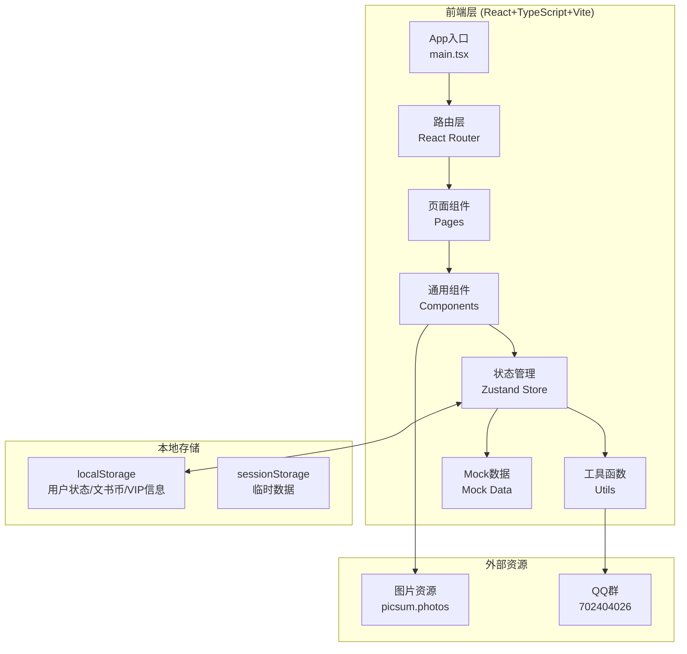
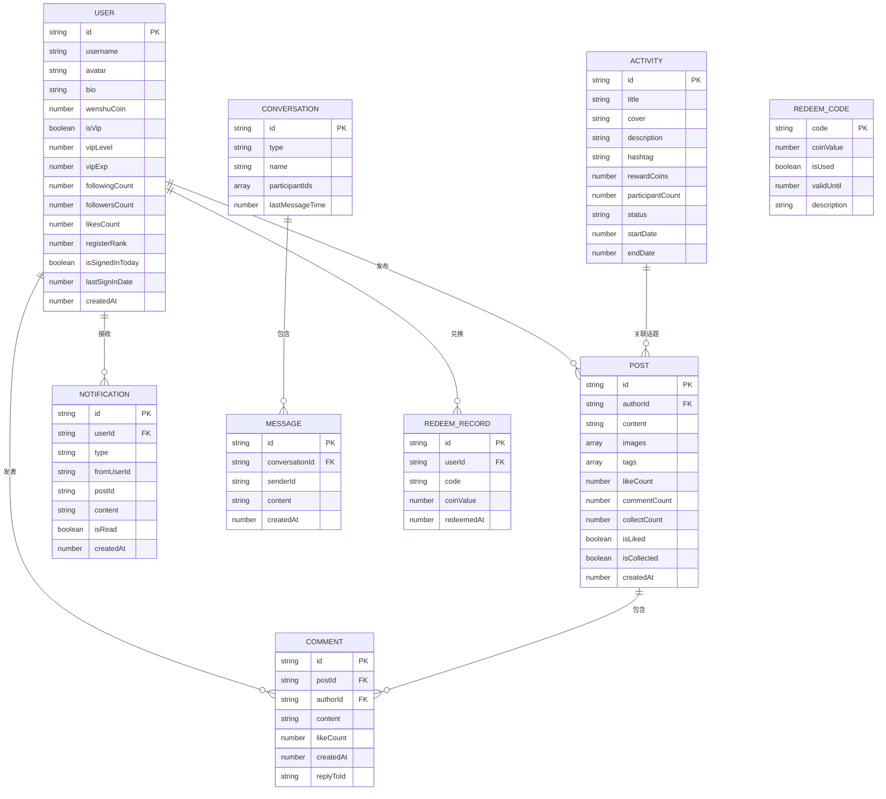

# 文书APP Web版 技术架构文档

## 1. 架构设计



## 2. 技术栈说明
- **前端框架**：React 18 + TypeScript 5
- **构建工具**：Vite 5
- **样式方案**：Tailwind CSS 3（黑白主题定制）+ CSS Modules
- **状态管理**：Zustand（轻量状态管理，适合中型应用）
- **路由**：React Router DOM 6
- **图标库**：Lucide React（线性图标，符合简约风格）
- **动画**：Framer Motion（流畅的交互动画）
- **初始化工具**：create-vite (react-ts模板)
- **后端**：无（纯前端Mock，数据持久化使用localStorage）
- **数据库**：无后端，localStorage模拟持久化

## 3. 路由定义

| 路由路径 | 页面名称 | 说明 |
|---------|---------|------|
| / | 首页 | 帖子列表流，最新/最热Tab |
| /activities | 活动页 | 全部/进行中/已结束活动列表 |
| /vip | 会员页 | 文书会VIP介绍、开通、等级详情 |
| /profile | 我的页 | 个人主页、数据统计、功能入口 |
| /post/:id | 帖子详情 | 单帖详情、评论、互动 |
| /publish | 发帖页 | 内容编辑、图片上传、话题选择 |
| /messages | 消息页 | 通知列表、聊天入口 |
| /settings | 设置页 | 设置列表、兑换码、退出登录 |
| /redeem | 兑换码页 | 兑换码输入、兑换记录 |
| /search | 搜索页 | 搜索帖子/用户/话题 |
| /activity/:id | 活动详情 | 单个活动详情与参与入口 |
| /chat/:id? | 聊天页 | QQ群/私信聊天界面 |
| /edit-profile | 编辑资料 | 修改昵称/头像/简介 |

## 4. 数据模型定义

### 4.1 ER图


### 4.2 TypeScript类型定义
```typescript
// 用户
interface User {
  id: string;
  username: string;
  avatar: string;
  bio: string;
  wenshuCoin: number;
  isVip: boolean;
  vipLevel: number; // 1-100
  vipExp: number;
  followingCount: number;
  followersCount: number;
  likesCount: number;
  registerRank: number;
  isSignedInToday: boolean;
  lastSignInDate: number;
  createdAt: number;
}

// 帖子
interface Post {
  id: string;
  authorId: string;
  author?: User;
  content: string;
  images: string[];
  tags: string[];
  likeCount: number;
  commentCount: number;
  collectCount: number;
  isLiked: boolean;
  isCollected: boolean;
  isVideo?: boolean;
  createdAt: number;
}

// 评论
interface Comment {
  id: string;
  postId: string;
  authorId: string;
  author?: User;
  content: string;
  likeCount: number;
  isLiked: boolean;
  createdAt: number;
  replyToId?: string;
  replyToUser?: User;
}

// 活动
interface Activity {
  id: string;
  title: string;
  cover: string;
  description: string;
  hashtag: string;
  rewardCoins: number;
  participantCount: number;
  status: 'active' | 'ended' | 'upcoming';
  startDate: number;
  endDate: number;
  rules: string[];
}

// 通知
interface Notification {
  id: string;
  type: 'like' | 'comment' | 'follow' | 'system' | 'redeem_success';
  fromUserId?: string;
  fromUser?: User;
  postId?: string;
  content: string;
  isRead: boolean;
  createdAt: number;
}

// 会话
interface Conversation {
  id: string;
  type: 'group' | 'private';
  name: string;
  avatar?: string;
  participantIds: string[];
  lastMessage?: string;
  lastMessageTime: number;
  unreadCount: number;
}

// 消息
interface Message {
  id: string;
  conversationId: string;
  senderId: string;
  content: string;
  createdAt: number;
}

// 兑换码
interface RedeemCode {
  code: string;
  coinValue: number;
  description: string;
  validUntil: number;
  isUsed: boolean;
}

// 兑换记录
interface RedeemRecord {
  id: string;
  code: string;
  coinValue: number;
  redeemedAt: number;
}
```

## 5. 状态管理设计 (Zustand Store)

### Store拆分
| Store名称 | 职责 | 核心状态 |
|-----------|------|---------|
| useAuthStore | 用户认证 | currentUser, isLoggedIn, login(), logout(), register() |
| usePostStore | 帖子数据 | posts, hotPosts, feedPosts, loadPosts(), toggleLike(), toggleCollect(), addPost() |
| useActivityStore | 活动数据 | activities, loadActivities(), joinActivity() |
| useVipStore | VIP状态 | vipInfo, purchaseVip(), addVipExp() |
| useCoinStore | 文书币 | balance, signIn(), redeemCode(), addCoins() |
| useNotificationStore | 通知消息 | notifications, conversations, markAsRead(), sendMessage() |
| useUIStore | UI状态 | activeTab, showPublish, showSearch, toasts |

## 6. 目录结构
```
web/
├── public/
│   └── 文书.png          # App图标
├── src/
│   ├── main.tsx           # 入口
│   ├── App.tsx            # 根组件+路由
│   ├── index.css          # 全局样式+Tailwind
│   ├── types/             # TS类型定义
│   │   └── index.ts
│   ├── store/             # Zustand stores
│   │   ├── authStore.ts
│   │   ├── postStore.ts
│   │   ├── activityStore.ts
│   │   ├── vipStore.ts
│   │   ├── coinStore.ts
│   │   ├── notificationStore.ts
│   │   └── uiStore.ts
│   ├── data/              # Mock数据
│   │   ├── users.ts
│   │   ├── posts.ts
│   │   ├── activities.ts
│   │   ├── notifications.ts
│   │   └── redeemCodes.ts
│   ├── utils/             # 工具函数
│   │   ├── format.ts      # 时间格式化、数字格式化
│   │   ├── storage.ts     # localStorage封装
│   │   └── id.ts          # ID生成
│   ├── components/        # 通用组件
│   │   ├── layout/        # 布局组件(BottomNav, TopBar, FAB)
│   │   ├── post/          # 帖子相关(PostCard, PostGrid, CommentItem)
│   │   ├── activity/      # 活动相关(ActivityCard)
│   │   ├── vip/           # VIP相关(VipCard, PrivilegeCard)
│   │   ├── user/          # 用户相关(Avatar, UserListItem)
│   │   └── ui/            # 基础UI(Button, Input, Tag, Toast, Modal)
│   ├── pages/             # 页面组件
│   │   ├── HomePage.tsx
│   │   ├── ActivitiesPage.tsx
│   │   ├── VipPage.tsx
│   │   ├── ProfilePage.tsx
│   │   ├── PostDetailPage.tsx
│   │   ├── PublishPage.tsx
│   │   ├── MessagesPage.tsx
│   │   ├── SettingsPage.tsx
│   │   ├── RedeemPage.tsx
│   │   ├── SearchPage.tsx
│   │   ├── ActivityDetailPage.tsx
│   │   ├── ChatPage.tsx
│   │   └── EditProfilePage.tsx
│   └── hooks/             # 自定义Hooks
│       ├── useDoubleTap.ts
│       ├── useInfiniteScroll.ts
│       └── useToast.ts
├── index.html
├── vite.config.ts
├── tailwind.config.js
├── tsconfig.json
└── package.json
```

## 7. 关键实现说明

### 7.1 注册排名奖励
- 使用localStorage存储已注册用户列表，按注册顺序分配rank
- 前5名注册用户自动获得100000文书币，6-10名50000，11-15名10000
- 每个浏览器视为新用户(无后端情况下)，首次访问时模拟注册流程

### 7.2 每日签到
- 记录lastSignInDate时间戳
- 对比当天日期(YYYY-MM-DD格式)判断是否已签到
- 连续签到奖励递增(基础10币，连续每天+5，上限50/天)

### 7.3 VIP等级系统
- 开通价格¥0.99，模拟支付(点击即开通)
- 经验获取：每日签到+10exp，发帖+20exp，评论+5exp，点赞+1exp
- 升级公式：level所需exp = level * 100
- 等级上限100级

### 7.4 兑换码系统
- 预设有效兑换码列表(如WS2024=500币, QQGIFT=200币, etc.)
- 输入兑换码后校验有效性(是否存在、是否过期、是否已使用)
- 有效则增加文书币并记录兑换历史

### 7.5 动画策略
- 使用Framer Motion实现所有页面过渡和微交互
- 双击点赞使用AnimatePresence做大心出现/消失动画
- 帖子列表使用motion.div的initial/animate/whileInView实现滚动出现
- VIP经验条使用animate的width属性做平滑过渡

### 7.6 响应式布局
- Tailwind断点：sm=640px以下为手机全宽，以上居中max-w-md
- 桌面端显示居中手机框架效果(圆角边框+阴影)，移动端全屏
- 所有交互使用touch-action: manipulation防止双击缩放
