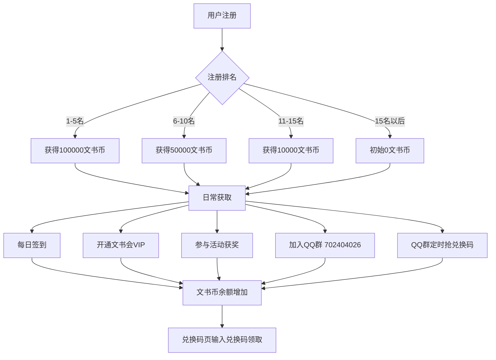
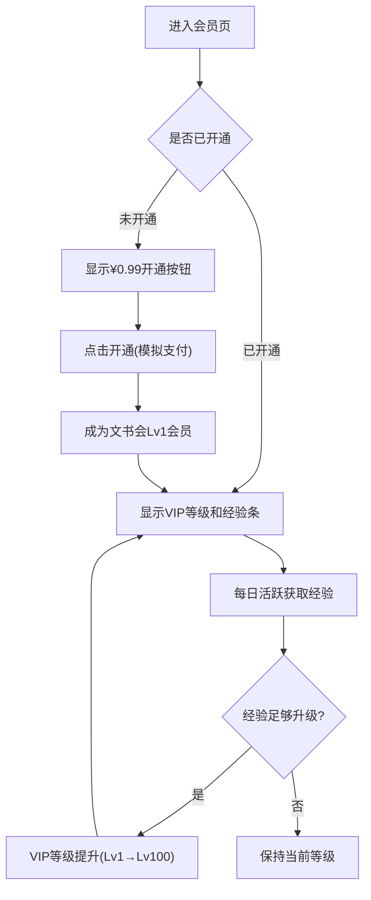
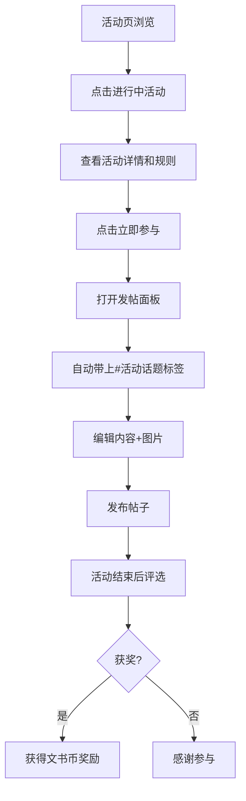

# 文书APP Web版 产品需求文档 (PRD)

## 1. 产品概述
文书APP是一款黑白极简风格的社区内容分享平台，融合小红书式帖子发布、会员体系、虚拟货币（文书币）、活动系统于一体。
- 核心定位：年轻用户社区，以#话题活动驱动内容创作，文书币激励用户活跃，文书会VIP提供特权体验
- 目标用户：喜欢分享日常、参与社区活动、追求简约高级审美的Z世代用户
- 市场价值：以虚拟货币+会员+活动三位一体的激励体系构建高粘性内容社区

## 2. 核心功能

### 2.1 用户角色
| 角色 | 注册方式 | 核心权限 |
|------|---------|---------|
| 普通用户 | 注册账号 | 浏览帖子、发布内容、每日签到、参与活动、使用兑换码、加入QQ群 |
| 文书会会员(VIP) | ¥0.99开通 | 专属标识、VIP等级(Lv1-100)、每日额外文书币、专属活动、会员徽章 |
| 首批注册用户 | 注册排名1-15 | 前5名获100000文书币，6-10名获50000，11-15名获10000 |

### 2.2 功能模块
1. **首页**：帖子列表（最新/最热）、搜索入口、消息入口、顶部导航
2. **活动页**：全部/进行中/已结束活动列表、话题标签发帖参与
3. **会员页**：文书会介绍、开通入口(¥0.99)、VIP等级展示、特权详情卡
4. **我的页**：个人信息、关注/粉丝/获赞收藏、发布的帖子、设置入口、每日签到
5. **发帖**：居中黑色圆形+按钮，富文本发布、图片上传、话题标签选择
6. **消息页**：通知列表、群聊入口、互关好友私信
7. **兑换码页**：输入兑换码领取文书币
8. **帖子详情页**：内容展示、点赞、评论、收藏、分享
9. **设置页**：账号设置、兑换码入口、退出登录(白底红字独立按钮组)

### 2.3 页面功能详情
| 页面名称 | 模块名称 | 功能描述 |
|---------|---------|---------|
| 首页 | 顶栏 | 左侧搜索图标、中间"首页"标题、右侧消息图标(含未读红点) |
| 首页 | Tab切换 | 最新/最热双Tab切换帖子流 |
| 首页 | 帖子卡片 | 头像、用户名、VIP标识、时间、正文预览、图片网格、点赞/评论/收藏数、双击点赞动画 |
| 首页 | 居中FAB | 黑色圆形白色加号按钮，点击打开发帖面板 |
| 活动页 | 顶栏 | "活动"标题 |
| 活动页 | 筛选Tab | 全部/进行中/已结束筛选 |
| 活动页 | 活动卡片 | 活动封面、标题、话题标签、参与人数、奖励文书币数、状态标签、剩余时间倒计时 |
| 活动页 | 活动详情 | 活动规则说明、参与方式(带#话题发帖)、获奖名单、立即参与按钮 |
| 会员页 | 顶栏 | "文书会"标题，带皇冠VIP图标 |
| 会员页 | VIP状态卡 | 未开通显示开通按钮¥0.99，已开通显示VIP等级(Lv1-100)、经验条、有效期 |
| 会员页 | 特权列表 | 每日额外文书币、专属标识、会员活动优先参与、专属徽章、头像框等特权卡片 |
| 会员页 | 等级进度 | 当前等级、下一等级所需经验、升级福利预览 |
| 我的页 | 头部信息 | 封面图、头像、昵称、VIP标识、文书币余额、编辑资料按钮 |
| 我的页 | 数据统计 | 关注数、粉丝数、获赞与收藏数，可点击查看列表 |
| 我的页 | 每日签到 | 签到按钮，签到成功获得文书币，连续签到额外奖励 |
| 我的页 | 功能入口 | 我的帖子、我的收藏、我的点赞、编辑资料 |
| 我的页 | 设置按钮 | 齿轮图标，进入设置页 |
| 发帖弹窗 | 编辑器 | 多行文本输入、图片上传网格(最多9张)、话题标签选择/输入 |
| 发帖弹窗 | 发布按钮 | 黑色圆角按钮，发布后回到首页新帖展示 |
| 消息页 | 通知列表 | 点赞通知、评论通知、关注通知、系统通知分组展示 |
| 消息页 | 聊天入口 | QQ群聊入口(QQ:702404026)、互关好友私信列表 |
| 兑换码页 | 输入框 | 兑换码输入区域、立即兑换按钮 |
| 兑换码页 | 兑换记录 | 历史兑换记录列表 |
| 帖子详情 | 内容区 | 完整内容、图片轮播、发布者信息、发布时间 |
| 帖子详情 | 互动区 | 点赞(含双击大心动画)、评论列表(支持回复)、收藏、分享 |
| 设置页 | 设置列表 | 账号安全、通知设置、隐私设置、关于我们、加入QQ群 |
| 设置页 | 兑换码入口 | 浅灰背景红色文字"兑换码"按钮 |
| 设置页 | 退出登录 | 独立按钮组，浅灰白底红色文字"退出登录"按钮 |

## 3. 核心流程

### 3.1 用户主流程
用户打开APP → 首页浏览帖子流 → 可切换最新/最热 → 点击帖子查看详情 → 点赞/评论/收藏
→ 点击居中+按钮 → 发帖编辑器 → 输入内容+图片+话题 → 发布成功
→ 顶栏消息按钮 → 查看通知/私信
→ 底部导航切换活动页/会员页/我的页

### 3.2 文书币获取流程

### 3.3 VIP会员流程

### 3.4 活动参与流程

## 4. 用户界面设计

### 4.1 设计风格
- **主色调**：纯黑(#000000)和纯白(#FFFFFF)双色主题，灰色层次分割，无其他彩色干扰
- **辅色**：红色(#FF2D55)用于退出登录按钮、未读红点、重要提示；金色(#D4AF37)用于VIP皇冠标识
- **按钮风格**：圆角矩形(12-16px圆角)，主按钮黑底白字，次按钮白底黑字黑边框，危险按钮浅灰底红字
- **字体**：中文使用思源黑体/Noto Sans SC，数字和英文使用SF Pro Display风格，字号层次：大标题20px bold，正文15px regular，辅助文字13px，小字12px
- **布局风格**：移动端优先设计，卡片式布局，底部4标签导航+居中FAB发帖按钮，顶栏固定
- **图标风格**：线性图标(2px描边)，简约现代，选中态填充黑色，未选中态灰色轮廓
- **动效**：页面切换淡入淡出，点赞心跳缩放，帖子加载渐入序列，签到成功撒币动画，VIP升级光效

### 4.2 页面设计概览
| 页面名称 | 模块名称 | UI元素描述 |
|---------|---------|-----------|
| 首页 | 顶栏 | 白底，搜索图标(黑)在左，"首页"标题居中粗体，消息图标(黑)+红点在右，底部1px灰分割线 |
| 首页 | Tab切换 | 最新/最热文字Tab，选中态底部2px黑色下划线，未选中灰色 |
| 首页 | 帖子卡片 | 白色卡片，圆角12px，头像圆形40px，VIP金色皇冠角标，正文最多3行预览，图片1-9张圆角网格，底部互动栏点赞/评论/收藏图标+数字 |
| 首页 | FAB按钮 | 固定底部居中，黑色圆形56px，白色+图标18px，上浮阴影，点击涟漪效果 |
| 活动页 | 顶栏 | "活动"标题居中，左侧活动图标装饰 |
| 活动页 | 筛选Tab | 三个等宽圆角chip，选中黑底白字，未选中灰底黑字 |
| 活动页 | 活动卡片 | 封面图(16:9圆角)叠加状态角标，下方标题、话题标签(灰色圆角tag)、参与人数+奖励币数、倒计时 |
| 会员页 | VIP状态卡 | 黑色渐变背景卡，金色皇冠图标，VIP等级大字显示，经验条金色进度，有效期小字 |
| 会员页 | 开通按钮 | 金色渐变按钮"¥0.99 立即开通文书会"，圆角全宽，阴影 |
| 会员页 | 特权卡 | 网格布局2列，白色卡片带黑色图标，特权名称+简短描述 |
| 我的页 | 头部 | 封面图(160px高)，头像圆形80px叠加封面底部偏移40px，白色边框3px，昵称18px bold，VIP标识金色小皇冠 |
| 我的页 | 文书币区域 | 金币图标+余额数字+"签到"按钮黑色圆角 |
| 我的页 | 数据栏 | 三列等宽，数字粗体大字，标签小字灰色，1px分割线 |
| 我的页 | 设置入口 | 右上角齿轮图标 |
| 设置页 | 设置组 | 白色背景分组，每组之间灰色间隔，列表项右箭头 |
| 设置页 | 兑换码按钮 | 独立分组，浅灰白底，红色文字"兑换码"，居中对齐 |
| 设置页 | 退出登录 | 最底部独立分组，浅灰白底，红色粗体文字"退出登录"，居中对齐，上下有足够间距 |

### 4.3 响应式设计
- 移动端优先：设计基准宽度375px(iPhone标准)，最大内容宽度480px居中
- 桌面端：内容区居中480px，两侧留白，模拟手机壳效果或直接居中展示
- 触摸优化：所有可点击区域最小44px，按钮最小高度44px，FAB按钮56px
- 图片响应式：使用object-cover，懒加载

### 4.4 交互动效
- 页面切换：opacity 0→1 + translateY 8px→0，250ms ease-out
- 点赞：scale 1→1.3→1 + 心形填充变红，300ms spring
- 双击点赞：大心形从中心弹出，scale 0→1.2→1→0.8→0(淡出)，600ms
- 签到成功：金币icon旋转+数字跳动+confetti效果
- FAB点击：scale 0.9→1 + 发帖面板从底部slide up
- 帖子加载：opacity 0→1 + translateY 20px→0，每个卡片延迟50ms序列
- VIP经验条：width平滑动画，金色shimmer扫光效果
